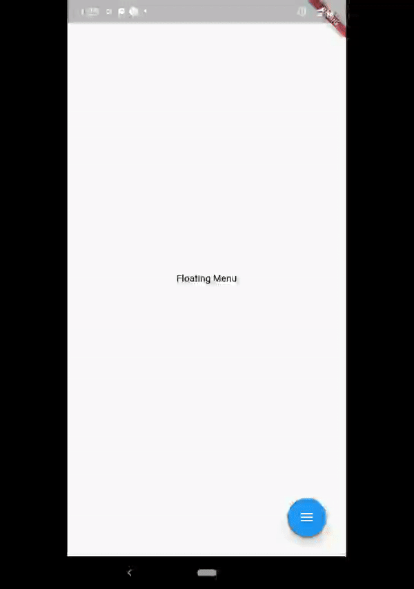

# Flutter Floating Menu Curved

A curved floating action menu.

## Getting Started

The Project is for setting up curved floating action menu using Transform animation.

Peaple were facing issue regarding touch event of transformed button but I have solved it.
Here is the demo.

| Home Screen |  
| ------------------ | 
|   | 

My next work would be try to convert this into library
